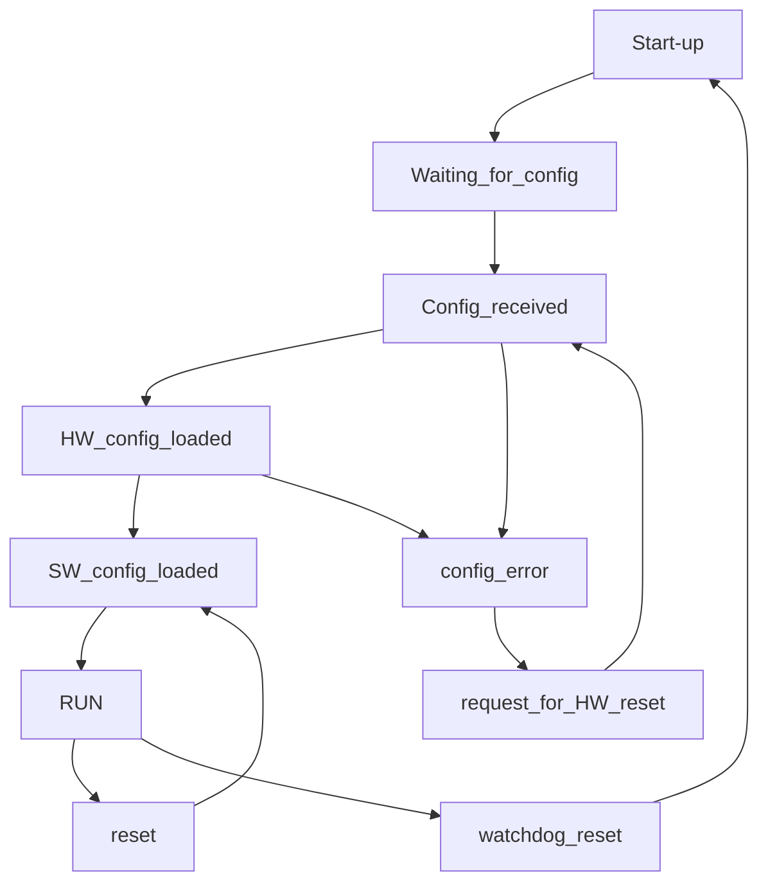

# Config, startup & reset

```mermaid
graph TD
  Start-up--> Waiting_for_config
  Waiting_for_config --> Config_received
  Config_received --> HW_config_loaded
  HW_config_loaded --> SW_config_loaded
SW_config_loaded -->RUN
RUN --> reset
reset --> SW_config_loaded
RUN --> watchdog_reset
watchdog_reset--> Start-up
Config_received --> config_error
HW_config_loaded --> config_error
config_error --> request_for_HW_reset
request_for_HW_reset --> Config_received
```
