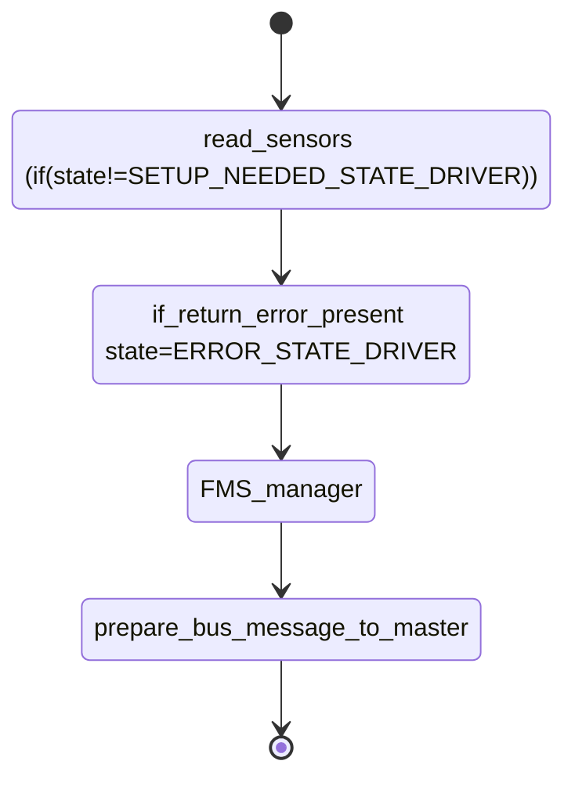

# Driver-loop

```mermaid
stateDiagram-v2
    [*] --> read_sensors
    read_sensors: read_sensors (if(state!=SETUP_NEEDED_STATE_DRIVER))
    read_sensors --> if_error_go_in_error_state
    if_error_go_in_error_state: if_return_error_present state=ERROR_STATE_DRIVER
    if_error_go_in_error_state --> FMS_manager
    FMS_manager --> prepare_bus_message_to_master
    prepare_bus_message_to_master --> [*]
```
