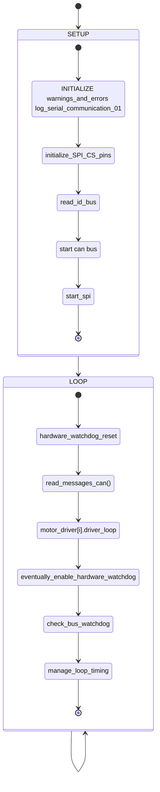

# Main

```mermaid
stateDiagram-v2
    [*] --> SETUP
    SETUP --> LOOP
    LOOP --> LOOP

state SETUP{
    [*] --> initialize_other_classes
    initialize_other_classes: INITIALIZE warnings_and_errors log_serial_communication_01
    initialize_other_classes --> initialize_SPI_CS_pins
    initialize_SPI_CS_pins --> read_id_bus
    read_id_bus --> start_bus
    start_bus: start can bus
    start_bus --> start_spi
    start_spi-->[*]
    }
 
 state LOOP{
    [*] --> hardware_watchdog_reset
    hardware_watchdog_reset --> read_messages_can()
    read_messages_can() --> motor_driver[i].driver_loop
    motor_driver[i].driver_loop --> eventually_enable_hardware_watchdog
    eventually_enable_hardware_watchdog --> check_bus_watchdog
    check_bus_watchdog -->  manage_loop_timing
    manage_loop_timing-->[*]
    }
```
