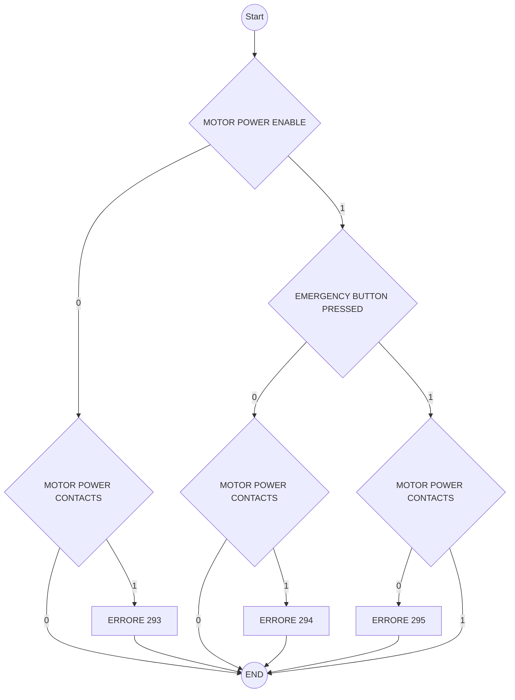
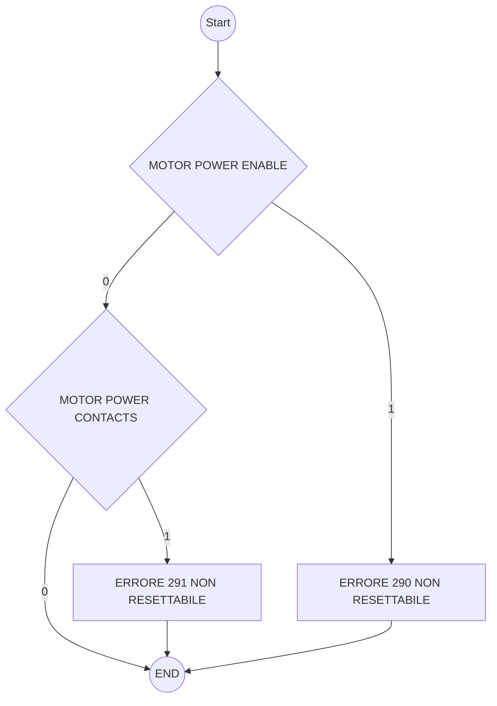

# Emergency\_stop\_monitor

## Requirements

1. Il componente deve essere una libreria statica che viene configurata dal main.
2. Deve essere periodicamente lanciata all'interno di other\_loop del main.
3. Il componente deve poter essere configurato con i seguenti parametri:
   1. pin di EMERGENCY BUTTON PRESSED (ingresso collegato al secondo contatto del fungo di emergenza)
   2. pin di MOTOR POWER CONTACTS (ingresso collegato al secondo contatto del relè che taglia potenza agli azionamenti)
   3. pin di MOTOR POWER ENABLE (uscita comandata dal microcontrollore)
4. Quando il contatto EMERGENCY BUTTON PRESSED si apre si deve generare errore 296 "ALLARME FUNGO PREMUTO"&#x20;
5. Deve esserci un controllo COSTANTE come da diagramma seguente, gestendo il ritardo di attuazione del relè:

6. All'avvio (alla configurazione) si ha la certezza che il MOTOR POWER ENABLE è =0 e bisogna eseguire il controllo come da diagramma seguente:

## Test list

1. ERRORE 296 ALLARME FUNGO PREMUTO: premendo il fungo si genera l'allarme
2. ERRORE 293: vedi diagramma sopra.
3. ERRORE 294:  vedi diagramma sopra.
4. ERRORE 295:  vedi diagramma sopra.
5. ERRORE 290:  vedi diagramma sopra.
6. ERRORE 290:  verificare che non sia resettabile.
7. ERRORE 291:  vedi diagramma sopra.
8. ERRORE 291:  verificare che non sia resettabile.
