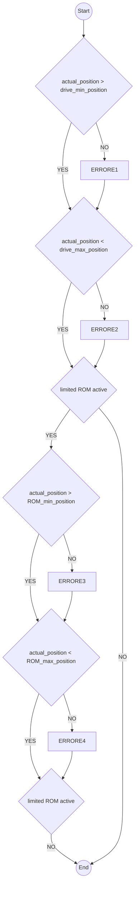
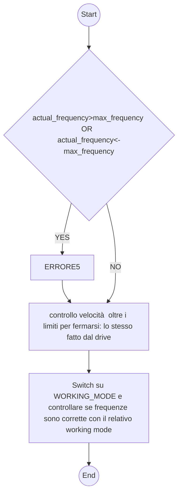

# Emergency\_stop\_supervisor

## Requirements

1. Il componente deve essere una libreria che viene instanziata dal main.
2. Deve essere periodicamente lanciata all'interno di other\_loop del main.
3. Il costruttore deve ricevere i seguenti parametri:
   1. pin di MOTOR POWER ENABLE
4. Durante il funzionamento deve ricevere i dati di posizione e velocità aggiornati con frequenza pari al loop main.
5. Effettua per ogni asse i seguenti controlli sulla posizione:

6. Effettua per ogni asse i seguenti controlli sulla velocità:

## Test list

1. TBD
