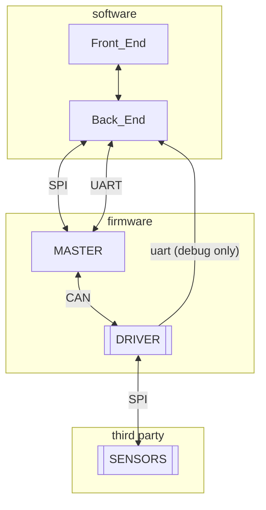

# Communication

```mermaid
flowchart TB
subgraph software [software ]
Front_End <-->  Back_End 
end
Back_End <--SPI--> MASTER
Back_End <--UART--> MASTER
subgraph firmware[firmware]
MASTER<--CAN-->DRIVER[[DRIVER]]
end
DRIVER--uart (debug only)-->Back_End 
DRIVER<--SPI-->SENSORS[[SENSORS]]
subgraph third_party[third party]
SENSORS
end
```
