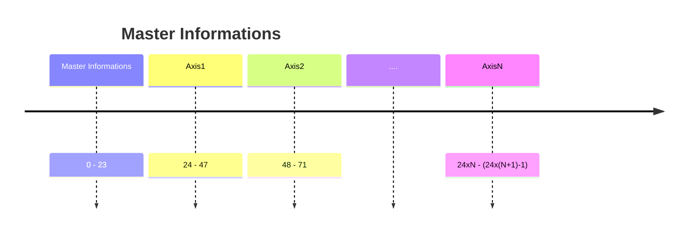

# Full structure

### Master full structure

<table><thead><tr><th width="79.90911865234375">Byte</th><th width="155.81817626953125">Nome</th><th width="111.5455322265625">Tipo Dato</th><th width="110.5455322265625">N bytes</th><th>Descrizione</th></tr></thead><tbody><tr><td>0-1</td><td>Header</td><td><code>int16</code></td><td>2</td><td>0xF00F</td></tr><tr><td>2-23</td><td>Master information</td><td><code>uint8</code></td><td>22</td><td>Informazioni dal master come da specifica</td></tr></tbody></table>

### Axis  full structure

<table><thead><tr><th width="79.90911865234375">Byte</th><th width="155.81817626953125">Nome</th><th width="111.5455322265625">Tipo Dato</th><th width="110.5455322265625">N bytes</th><th>Descrizione</th></tr></thead><tbody><tr><td>0-1</td><td>Header</td><td><code>int16</code></td><td>2</td><td>0xFFFF</td></tr><tr><td>2</td><td>Axis ID</td><td><code>uint8</code></td><td>1</td><td>Numero dell'asse</td></tr><tr><td>3-18</td><td>Axis information</td><td><code>uint8</code></td><td>16</td><td>Informazioni dal singolo asse, come da specifica</td></tr><tr><td>19–23</td><td>Footer</td><td><code>uint8</code></td><td>5</td><td>0xFF Per avere lo stesso numero di byte del master</td></tr></tbody></table>
