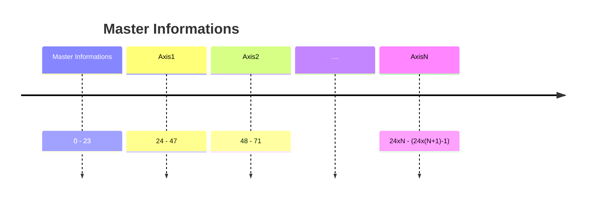

# Master->BE Full structure

Per garantire la correttezza del messaggio è previsto un byte di validazione per ogni messaggio . L'algoritmo di generazione del byte crc è il seguente:

<pre class="language-cpp"><code class="lang-cpp">crc = return_crc8(buffer_axis_received_data[axis_id], 1, 23);
<strong>
</strong><strong>uint8_t HMI_spi_communication_01::return_crc8(const uint8_t *data, int starting_index, int ending_index){
</strong>  uint8_t crc = 0x00;        // valore iniziale
  const uint8_t poly = 0x07; // polinomio

  for (size_t i = starting_index; i &#x3C;= ending_index; i++) {
      crc ^= data[i];
      for (uint8_t bit = 0; bit &#x3C; 8; bit++) {
          if (crc &#x26; 0x80) {
              crc = (uint8_t)((crc &#x3C;&#x3C; 1) ^ poly);
          } else {
              crc &#x3C;&#x3C;= 1;
          }
      }
  }
  return crc;
}
</code></pre>

### Master full structure

<table><thead><tr><th width="79.90911865234375">Byte</th><th width="155.81817626953125">Nome</th><th width="111.5455322265625">Tipo Dato</th><th width="110.5455322265625">N bytes</th><th>Descrizione</th></tr></thead><tbody><tr><td>0</td><td>CRC</td><td><code>uint8</code></td><td>1</td><td>come da algoritmo sopra</td></tr><tr><td>1</td><td>Header</td><td><code>uint8</code></td><td>1</td><td>0x0F</td></tr><tr><td>2-23</td><td>Master information</td><td><code>uint8</code></td><td>22</td><td>Informazioni dal master come da specifica</td></tr></tbody></table>

### Axis  full structure

<table><thead><tr><th width="79.90911865234375">Byte</th><th width="155.81817626953125">Nome</th><th width="111.5455322265625">Tipo Dato</th><th width="110.5455322265625">N bytes</th><th>Descrizione</th></tr></thead><tbody><tr><td>0</td><td>CRC</td><td><code>uint8</code></td><td>1</td><td>come da algoritmo sopra</td></tr><tr><td>1</td><td>Header</td><td><code>uint8</code></td><td>1</td><td>0xFF</td></tr><tr><td>2</td><td>Axis ID</td><td><code>uint8</code></td><td>1</td><td>Numero dell'asse</td></tr><tr><td>3-18</td><td>Axis information</td><td><code>uint8</code></td><td>16</td><td>Informazioni dal singolo asse, come da specifica</td></tr><tr><td>19–23</td><td>Footer</td><td><code>uint8</code></td><td>5</td><td>0xFF Per avere lo stesso numero di byte del master</td></tr></tbody></table>
