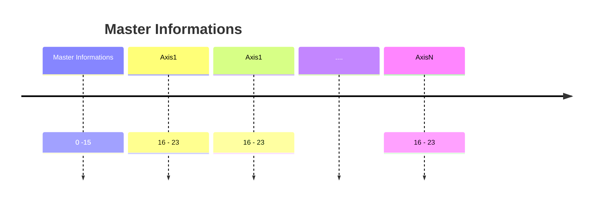

# Page 1

### Master Informations

<table><thead><tr><th width="79.90911865234375">Byte</th><th width="155.81817626953125">Nome</th><th width="111.5455322265625">Tipo Dato</th><th width="110.5455322265625">N bytes</th><th>Descrizione</th></tr></thead><tbody><tr><td>0</td><td>Status booleans byte</td><td><code>bool</code></td><td>1</td><td>Stato attuale in formato boolean</td></tr><tr><td>1</td><td>Status + WorkingMode</td><td><code>uint8</code></td><td>1</td><td>Stato + modalità operativa</td></tr><tr><td>2–3</td><td>Actual Position</td><td><code>int16</code></td><td>2</td><td>Posizione attuale dell'asse in risoluzione del sensore</td></tr><tr><td>4–5</td><td>Actual Torque</td><td><code>int16</code></td><td>2</td><td>Coppia attuale dell'asse in risoluzione del sensore</td></tr><tr><td>6–9</td><td>Actual Frequency</td><td><code>float32</code></td><td>4</td><td>Velocità dell'asse in microsteps al secondo</td></tr><tr><td>10–11</td><td>Error Code</td><td><code>uint16</code></td><td>2</td><td>Codice errore</td></tr><tr><td>12–13</td><td>Warning Code</td><td><code>uint16</code></td><td>2</td><td>Codice warning</td></tr></tbody></table>

#### Status booleans byte - Master Informations

<table><thead><tr><th width="79.90911865234375">Bit</th><th width="155.81817626953125">Nome</th><th width="111.5455322265625">Tipo Dato</th><th>Descrizione</th></tr></thead><tbody><tr><td>7</td><td>Parity</td><td><code>bit</code></td><td>Bit di parità per validare il byte (gli 1 sono sempre pari)</td></tr><tr><td>6</td><td>Debug</td><td><code>bit</code></td><td>Not used</td></tr><tr><td>4-5</td><td>Spare</td><td><code>bit</code></td><td>Not used</td></tr><tr><td>3</td><td>Error</td><td><code>bit</code></td><td>0 ->no error</td></tr><tr><td>2</td><td>Warning</td><td><code>bit</code></td><td>0 ->no warning</td></tr><tr><td>1</td><td>Motion ongoing</td><td><code>bit</code></td><td></td></tr><tr><td>0</td><td>On target position</td><td><code>bit</code></td><td></td></tr></tbody></table>

#### Status + WorkingMode - Master Informations

<table><thead><tr><th width="79.90911865234375">Bit</th><th width="155.81817626953125">Nome</th><th width="111.5455322265625">Tipo Dato</th><th>Descrizione</th></tr></thead><tbody><tr><td>4-7</td><td>Status</td><td><code>uint4</code></td><td>Stato della FSM del master</td></tr><tr><td>0-3</td><td>Working mode</td><td><code>uint4</code></td><td>Working mode attuale</td></tr></tbody></table>

### Axis Informations

<table><thead><tr><th width="79.90911865234375">Byte</th><th width="155.81817626953125">Nome</th><th width="111.5455322265625">Tipo Dato</th><th width="110.5455322265625">N bytes</th><th>Descrizione</th></tr></thead><tbody><tr><td>0</td><td>Status bool byte</td><td><code>bool</code></td><td>1</td><td>Stato attuale in formato boolean</td></tr><tr><td>1</td><td>Status + Mode</td><td><code>uint8</code></td><td>1</td><td>Stato + modalità operativa</td></tr><tr><td>2–3</td><td>Actual Position</td><td><code>int16</code></td><td>2</td><td>Posizione attuale dell'asse in risoluzione del sensore</td></tr><tr><td>4–5</td><td>Actual Torque</td><td><code>int16</code></td><td>2</td><td>Coppia attuale dell'asse in risoluzione del sensore</td></tr><tr><td>6–9</td><td>Actual Frequency</td><td><code>float32</code></td><td>4</td><td>Velocità dell'asse in microsteps al secondo</td></tr><tr><td>10–11</td><td>Error Code</td><td><code>uint16</code></td><td>2</td><td>Codice errore</td></tr><tr><td>12–13</td><td>Warning Code</td><td><code>uint16</code></td><td>2</td><td>Codice warning</td></tr></tbody></table>
