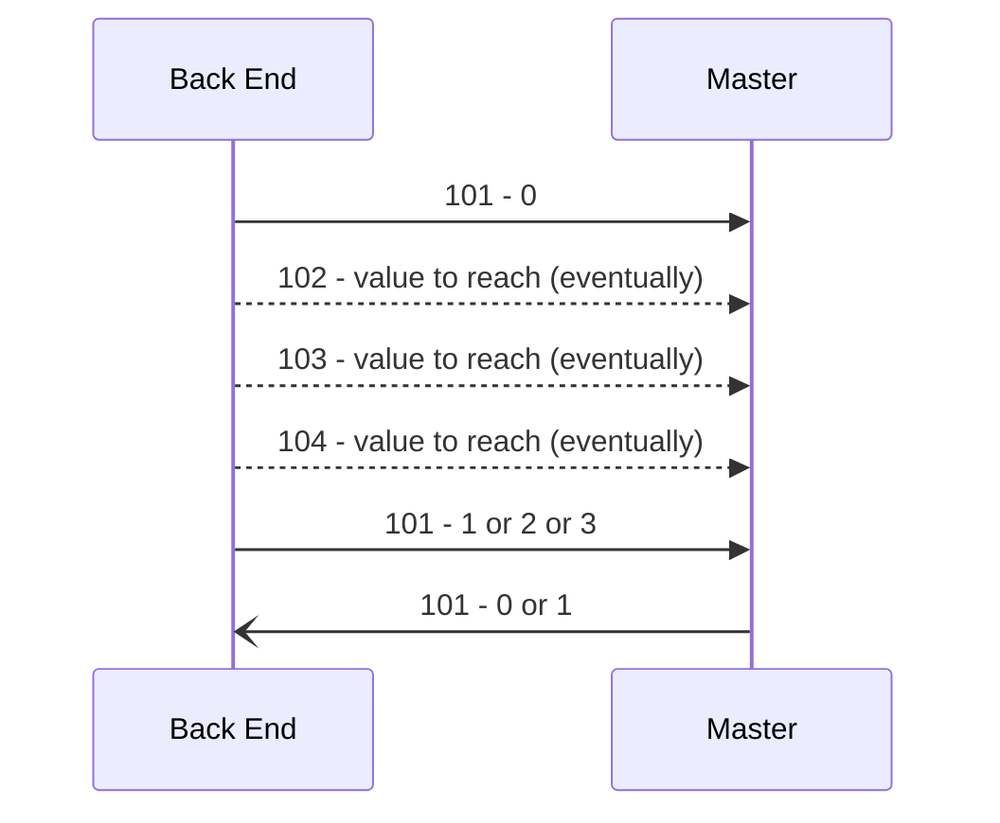

# Specifica comunicazione UART

## 📘 Introduzione

La comunicazione avviene tramite una serie di registri identificati da ID numerici. Ogni registro rappresenta un parametro definito, un formato e una direzione di comunicazione univoca.\
\
Tutti i messaggi seriali hanno il seguente formato: 

\#address:value\*\
\
altri separatori o terminali posso essere AGGIUNTI (senza mai rimuovere quelli sopra indicati) se il tipo di dato lo richiede(per esempio terminale aggiuntivo nelle stringhe)

I registri sono classificati in base al tipo di dato trasportato, secondo i seguenti intervalli:

| Intervallo     | Tipo di dato     | Descrizione         |
| -------------- | ---------------- | ------------------- |
| 1 < ID < 9     | String           | stringhe            |
| 10 < ID < 49   | uint\_8          | unsigned int 1 byte |
| 50 < ID < 199  | int\_16          | intero 2 byte       |
| 200 < ID < 399 | float            | float               |
| 400 < ID < 499 | boolean          | bool                |
| 500 < ID < 599 | long int (int32) | long int (4 byte)   |

È anche possibile raggruppare i registri in base alla loro funzione logica come segue:

<table><thead><tr><th width="211">Gruppo</th><th>From->To</th><th width="387">Descrizione</th></tr></thead><tbody><tr><td>Parametri operativi</td><td>HMI->Master</td><td>
-6 id e URL per download .bin per aggiornamento software OverTheAir

-8-9 SSID e password WI-FI per aggiornamento software OverTheAir 

-10 Master working mode -11 Test cycle

-12-16 Driver working mode(for External Developer only) -50-54 Posizioni angolari da raggiungere -80-84 Velocità massima del singolo movimento -101-104 e 210-211 Posizioni cartesiane da raggiungere

-105-107 Velocità target cartesiane da raggiungere -109 Attiva e disattiva limiti di posizione (ROM) -180-184 TORQUE_CUSTOM banda morta -185-189 TORQUE_CUSTOM k proporzionale -190-194 TORQUE_CUSTOM k esponenziale -195-199 TORQUE_CUSTOM k derivativo
</td></tr><tr><td>Informazioni all'avvio</td><td>Master->HMI</td><td>-1 Numero di serie -2 Numero di assi -7 Versione del software</td></tr><tr><td>Informazioni durante il funzionamento</td><td>Master->HMI</td><td>-100 Percentuale di carica della batteria</td></tr><tr><td>Settaggi all'avvio</td><td>Master->HMI</td><td>
-160-164 Pos min per ogni asse -170-174 Pos max per ogni asse -220-224 Fattore di conversione della velocità degli assi da microsteps/sec a gradi/sec  Per ogni sensore di posizione: -130-134 Risoluzione

-140-144 Zero -200-204 Corsa -400-404 Direzione

 -230-231 Dati della molla di compensazione dell'asse 2.
</td></tr><tr><td>Settaggi da interfaccia</td><td>HMI->Master</td><td>
-60-64 Limite di velocità avanzato

-70-74 Limite di velocità utente

-90-93 Regolazioni movimento assistito -110-114 Pos min ROM per ogni asse -120-124 Pos max ROM per ogni asse
</td></tr></tbody></table>

***

#### 🔹 Parametri operativi: Comando e URL per aggiornamento firmware OTA

| Registro | Tipo   | Descrizione                                                                  | Direzione    |
| -------- | ------ | ---------------------------------------------------------------------------- | ------------ |
| 6        | String | id(int 2 byte) e URL per download .bin per aggiornamento software OverTheAir | HMI ->Master |

La stringa deve essere per esempio 0;`http://10.42.0.1:8000/firmware/arduino_01/firmware.bin*`&#x20;

L'indice è 0 per il master, 1 per driver 1 , 2 per driver 2, etc...\
\
La stringa dell'url termina con un \* aggiuntivo.

#### 🔹 Parametri operativi: SSID e password WI-FI per agg. firmware OTA&#x20;

| Registro | Tipo   | Descrizione   | Direzione    |
| -------- | ------ | ------------- | ------------ |
| 8        | String | SSID WIFI     | HMI ->Master |
| 9        | String | Password WIFI | HMI ->Master |

Alle stringhe viene aggiunto alla fine \* per indicare che la fine della stringa. Quindi il messaggio sarà per esempio:\
\#0x0008:nome\_del\_wifi\*\*

\#0x0009:password\*\*

#### 🔹 Parametri operativi: Master working Mode

<table><thead><tr><th width="88">Registro</th><th width="521">Descrizione</th><th>Direzione</th><th data-hidden>Tipo</th></tr></thead><tbody><tr><td>10</td><td>Modalità di lavoro del Master da attivare</td><td>HMI → Master</td><td>int</td></tr></tbody></table>

#### 🔹 Parametri operativi: Test Cycle

<table><thead><tr><th width="88">Registro</th><th width="521">Descrizione</th><th>Direzione</th><th data-hidden>Tipo</th></tr></thead><tbody><tr><td>11</td><td>Numero del ciclo di test</td><td>HMI → Master</td><td>int</td></tr></tbody></table>

#### 🔹 Parametri operativi: Driver working mode

<table><thead><tr><th width="115">Registro</th><th width="499">Descrizione</th><th>Direzione</th><th data-hidden>Tipo</th></tr></thead><tbody><tr><td>12–>Asse 1 13–>Asse 2 14–>Asse 3 15–>Asse 4 16–>Asse 5</td><td>Modalità di lavoro del driver da attivare Ad oggi attivati solo per EXTERNAL DEVELOPER</td><td>HMI → Master</td><td>int</td></tr></tbody></table>

#### 🔹 Parametri operativi: Posizioni Angolari da raggiungere

#### Con questi registri vengono passati i valori delle posizioni che ogni asse deve raggiungere nel working mode TARGET POSITION. Può essere passata anche solo una posizione. Il dato è in bit e non in deg.

<table><thead><tr><th width="118">Registro</th><th width="496">Descrizione</th><th>Direzione</th></tr></thead><tbody><tr><td>50–>Asse 1 51–>Asse 2 52–>Asse 3 53–>Asse 4 54–>Asse 5</td><td>Posizione target per ciascun asse </td><td>HMI → Master</td></tr></tbody></table>

#### 🔹 Parametri operativi: Posizioni Cartesiane da raggiungere

Con questi registri vengono passati i valori delle posizioni cartesiane dell'estremità dell'esoschetro da raggiungere. La conversione dello spazio degli assi viene fatta internamente. che ogni asse deve raggiungere nel working mode TARGET POSITION. Può essere passata anche solo una posizione. Il dato è in bit e non in deg. 

<table><thead><tr><th width="125.45452880859375">Registro</th><th width="87.90911865234375">Tipo</th><th>Descrizione</th><th>Direzione</th></tr></thead><tbody><tr><td>101</td><td>int</td><td>
0 - START MSG; 1 - Go without check; 2 - Go with check;

3 - check only
</td><td>HMI → Master</td></tr><tr><td>102–>X 103–>Y 104–>Z</td><td>int</td><td>Posizione cartesiana target (XYZ)</td><td>HMI → Master</td></tr><tr><td>210–>G3 211->G5</td><td>float</td><td></td><td></td></tr><tr><td>101</td><td>int</td><td>0 - no error; 1 - pos not reachable</td><td>Master→ HMI </td></tr></tbody></table>

#### 🔹  Parametri operativi: Velocità Cartesiane target da raggiungere

Con questi registri vengono passati i valori per il controllo in velocità nel piano cartesiano dell'estremità dell'esoschetro. La conversione dello spazio degli assi viene fatta internamente. Può essere passata anche solo una velocità. Il dato è in percentuale da -100% a 100%. 

<table><thead><tr><th width="125.45452880859375">Registro</th><th width="87.90911865234375">Tipo</th><th>Descrizione</th><th>Direzione</th></tr></thead><tbody><tr><td>105–>vel X 106–>vel Y 107–>vel Z</td><td>int</td><td>Velocità cartesiana target (XYZ)</td><td>HMI → Master</td></tr></tbody></table>

#### 🔹  Parametri operativi: Velocità Massima Movimento

<table><thead><tr><th width="124.27276611328125">Registro</th><th width="88.81817626953125">Tipo</th><th>Descrizione</th><th>Direzione</th></tr></thead><tbody><tr><td>80–>Asse 1 81–>Asse 2 82–>Asse 3 83–>Asse 4 84–>Asse 5</td><td>int</td><td>Velocità massima per asse da applicare all'interno della sessione corrente.</td><td>HMI → Master</td></tr></tbody></table>

***

### 🔍 Informazioni all’Avvio

Registri fondamentali per l’identificazione del sistema al momento dell’accensione. Il Master comunica informazioni strutturali e di sistema all’HMI. Lo stesso registro è usato dall'HMI per chiedere il dato. Il Master lo invia unicamente come risposta alla richiesta.

#### 🔹 Numero di Serie

| Registro | Tipo   | Descrizione                    | Direzione      |
| -------- | ------ | ------------------------------ | -------------- |
| 1        | String | Codice seriale del dispositivo | Master <-> HMI |

#### 🔹 Numero di Assi

| Registro | Tipo   | Descrizione                | Direzione      |
| -------- | ------ | -------------------------- | -------------- |
| 2        | String | Numero di assi disponibili | Master <-> HMI |

#### 🔹 Versione Software

| Registro | Tipo   | Descrizione                  | Direzione      |
| -------- | ------ | ---------------------------- | -------------- |
| 7        | String | Versione software del Master | Master <-> HMI |

***

### Informazioni durante il funzionamento

Contiene registri relativi ai parametri statici per ogni asse, come posizioni min/max e configurazioni dei sensori.

| Registro | Tipo | Descrizione                          | Direzione    |
| -------- | ---- | ------------------------------------ | ------------ |
| 100      | int  | Percentuale di carica della batteria | Master → HMI |

### 🛠️ Settaggi all’Avvio

Contiene registri relativi ai parametri statici per ogni asse, come posizioni min/max e configurazioni dei sensori.

#### 🔹 Posizione Min ASSE nel file di configurazione (pos\_min nel file cfg)

<table><thead><tr><th width="258.111083984375">Registro</th><th>Tipo</th><th>Descrizione</th><th>Direzione</th></tr></thead><tbody><tr><td>160–>Asse 1 161–>Asse 2 162–>Asse 3 163–>Asse 4 164–>Asse 5</td><td>int</td><td>Posizioni min per ogni asse</td><td>Master → HMI</td></tr></tbody></table>

#### 🔹 Posizione Min ASSE nel file di configurazione (pos\_max nel file cfg)

<table><thead><tr><th width="187.111083984375">Registro</th><th width="81">Tipo</th><th width="350">Descrizione</th><th>Direzione</th></tr></thead><tbody><tr><td>170–>Asse 1 171–>Asse 2 172–>Asse 3 173–>Asse 4 174–>Asse 5</td><td>int</td><td>Posizioni max per ogni asse</td><td>Master → HMI</td></tr></tbody></table>

#### 🔹 Fattore di conversione della velocità

<table><thead><tr><th width="188">Registro</th><th width="84">Tipo</th><th width="338">Descrizione</th><th>Direzione</th></tr></thead><tbody><tr><td>220–>Asse 1 221–>Asse 2 222–>Asse 3 223–>Asse 4 224–>Asse 5</td><td>float</td><td>Fattore di conversione della velocità degli assi da microsteps/sec a gradi/seci. </td><td>Master → HMI</td></tr></tbody></table>

#### 🔹 Risoluzione del sensore di posizione (position\_sensor\_resolution nel file cfg)

| Registro                                                                       | Tipo | Descrizione                                                                                                                                             | Direzione    |
| ------------------------------------------------------------------------------ | ---- | ------------------------------------------------------------------------------------------------------------------------------------------------------- | ------------ |
| 
130–>Asse 1 131–>Asse 2 132–>Asse 3 133–>Asse 4 134–>Asse 5
 | int  | Risoluzione trasduttore di posizione per asse. è abbinata alla corsa. Le 2 insieme determinano le costanti per la conversione da bit a gradi angolari.  | Master → HMI |

#### 🔹 Zero del sensore di posizione (position\_sensor\_offset\_kinematics nel file cfg)

| Registro                                                                       | Tipo | Descrizione                                                                                | Direzione    |
| ------------------------------------------------------------------------------ | ---- | ------------------------------------------------------------------------------------------ | ------------ |
| 
140–>Asse 1 141–>Asse 2 142–>Asse 3 143–>Asse 4 144–>Asse 5
 | int  | Valore di zero trasduttore di posizione per asse per la traformazione bit-> gradi angolari | Master → HMI |

#### 🔹 Corsa del sensore di posizione (position\_sensor\_stroke nel file cfg)

| Registro                                                                       | Tipo  | Descrizione                                                                                                                                                 | Direzione    |
| ------------------------------------------------------------------------------ | ----- | ----------------------------------------------------------------------------------------------------------------------------------------------------------- | ------------ |
| 
200–>Asse 1 201–>Asse 2 202–>Asse 3 203–>Asse 4 204–>Asse 5
 | float | Corsa del trasduttore di posizione per asse. è abbinata alla risoluzione. Le 2 insieme determinano le costanti per la conversione da bit a gradi angolari.  | Master → HMI |

#### 🔹 Direzione del sensore di posizione (position\_sensor\_dir\_inverted\_kinematics nel file cfg)

| Registro                                                                       | Tipo    | Descrizione                                                                             | Direzione    |
| ------------------------------------------------------------------------------ | ------- | --------------------------------------------------------------------------------------- | ------------ |
| 
400–>Asse 1 401–>Asse 2 402–>Asse 3 403–>Asse 4 404–>Asse 5
 | boolean | Direzione movimento (normal/invertita). Si usa nella traformazione bit-> gradi angolari | Master → HMI |

#### 🔹 Dati della molla di compensazione asse 2

| Registro          | Tipo  | Descrizione                                                                                                                    | Direzione    |
| ----------------- | ----- | ------------------------------------------------------------------------------------------------------------------------------ | ------------ |
| 230–>Offset molla | float | 
spring_2_offset

Valore in bit Valore della sola molla di compensazione della gravità quando asse_2=zero gradi.
 | Master → HMI |
| 231–>K molla      | float | 
spring_2_k

Valore in bit/grado Rigidità della molla al variare degli angoli positivi in gradi.
                 | Master → HMI |

***

### 🧩 Settaggi da Interfaccia

Parametri configurabili dall’utente tramite HMI.

#### 🔹 Range of motion limits(ROM): posizione Min/Max e enable

<table><thead><tr><th width="258.111083984375">Registro</th><th>Tipo</th><th>Descrizione</th><th>Direzione</th></tr></thead><tbody><tr><td>109-> ROM enable</td><td>int</td><td>0 – disable ROM limits; 1 – enable ROM limits</td><td>HMI → Master</td></tr><tr><td>110–> ROM min Asse 1 111–> ROM min Asse 2 112–> ROM min Asse 3 113–> ROM min Asse 4 114–> ROM min Asse 5</td><td>int</td><td>Posizioni min e max ROM per ogni asse</td><td>HMI → Master</td></tr><tr><td>

120–> ROM max Asse 1

121–> ROM max Asse 2

122–> ROM max Asse 2

123–> ROM max Asse 4

124–> ROM max Asse 5
</td><td>int</td><td>Posizioni min e max ROM per ogni asse</td><td>HMI → Master</td></tr></tbody></table>

#### 🔹 Limite Velocità Avanzata&#x20;

| Registro                                                                  | Tipo | Descrizione                                                                                          | Direzione    |
| ------------------------------------------------------------------------- | ---- | ---------------------------------------------------------------------------------------------------- | ------------ |
| 
60–>Asse 1 61–>Asse 2 62–>Asse 3 63–>Asse 4 64–>Asse 5
 | int  | Percentuale di velocità massima per asse da applicare sempre. Accessibile solo dall'utente avanzato. | HMI → Master |

***

#### 🔹 Limite Velocità Utente

| Registro                                                                  | Tipo | Descrizione                                                                                                           | Direzione    |
| ------------------------------------------------------------------------- | ---- | --------------------------------------------------------------------------------------------------------------------- | ------------ |
| 
70–>Asse 1 71–>Asse 2 72–>Asse 3 73–>Asse 4 74–>Asse 5
 | int  | Percentuale di velocità massima per asse da applicare sempre. Va in cascata  a quella avanzata. Accessibile da tutti. | HMI → Master |

#### 🔹 Regolazioni del movimento assistito (compliante)

<table><thead><tr><th width="308.11114501953125">Registro</th><th width="72.6666259765625">Tipo</th><th width="229.6666259765625">Descrizione</th><th>Direzione</th></tr></thead><tbody><tr><td>90–>Lunghezza braccio </td><td>int</td><td>Dato in mm relativo alla regolazione della lunghezza del braccio.</td><td>HMI → Master</td></tr><tr><td>91–>Percentuale peso braccio </td><td>int</td><td>Percentuale di peso da usare nella funzione torque predictor.</td><td>HMI → Master</td></tr><tr><td>92–>Lunghezza avanbraccio </td><td>int</td><td>Dato in mm relativo alla regolazione della lunghezza del avanbraccio.</td><td>HMI → Master</td></tr><tr><td>93–>Percentuale peso avanbraccio</td><td>int</td><td>Percentuale di peso da usare nella funzione torque predictor.</td><td>HMI → Master</td></tr></tbody></table>
