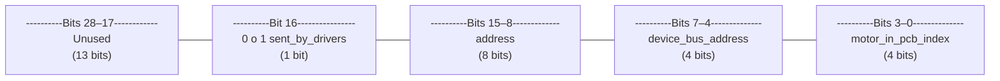
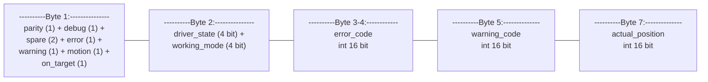
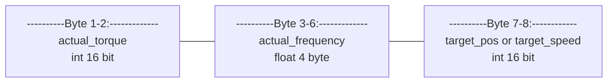

# Master - Driver

Schema dell'idenficatore dei messaggio:

```mermaid
flowchart LR
    ID1["----------Bits 28–17------------<br>Unused<br>(13 bits)"]
    ID2["----------Bit 16----------------<br>0 o 1 sent_by_drivers<br>(1 bit)"]
    ID3["----------Bits 15–8-------------<br>address<br>(8 bits)"]
    ID4["----------Bits 7–4--------------<br>device_bus_address<br>(4 bits)"]
    ID5["----------Bits 3–0--------------<br>motor_in_pcb_index<br>(4 bits)"]

    ID1 --- ID2 --- ID3 --- ID4 --- ID5


```

Risposta con address 25:

```mermaid
flowchart LR
    ID1["----------Byte 1:---------------<br>parity (1) + debug (1) + <br>spare (2) + error (1) + <br>warning (1) + motion (1) +<br> on_target (1)"]
    ID2["----------Byte 2:---------------<br>driver_state (4 bit) +<br> working_mode (4 bit)<br><br>"]
    ID3["----------Byte 3-4:------------<br>error_code<br>int 16 bit<br><br>"]
    ID4["----------Byte 5:--------------<br>warning_code<br>int 16 bit<br><br>"]
    ID5["----------Byte 7:--------------<br>actual_position<br>int 16 bit<br><br>"]
   ID1---ID2---ID3---ID4---ID5

```

Risposta con address 26:

```mermaid
flowchart LR
    ID1["----------Byte 1-2:-------------<br>actual_torque<br>int 16 bit"]
    ID2["----------Byte 3-6:-------------<br>actual_frequency<br>float 4 byte"]
    ID3["----------Byte 7-8:------------<br>target_pos or target_speed<br>int 16 bit<br>"] 
   ID1--- ID2--- ID3
```
