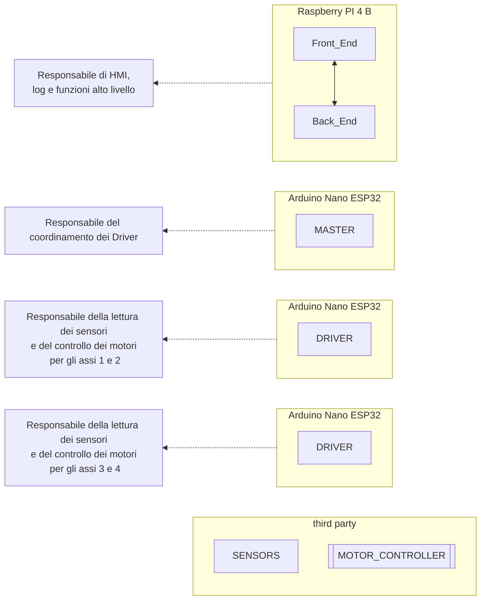

# Hardware schematics

1. Raspberry Pi 4 B
   * Ubuntu Server v.24.04
   * Componente software: Front\_End e Back\_End&#x20;
   * Linguaggio:Node JS
2. Arduino Nano ESP32
   * Componente software: Master e Driver
   * Linguaggio:C
3. Componenti che contengono firmware di terze parti
   * Sensori e azionamenti

