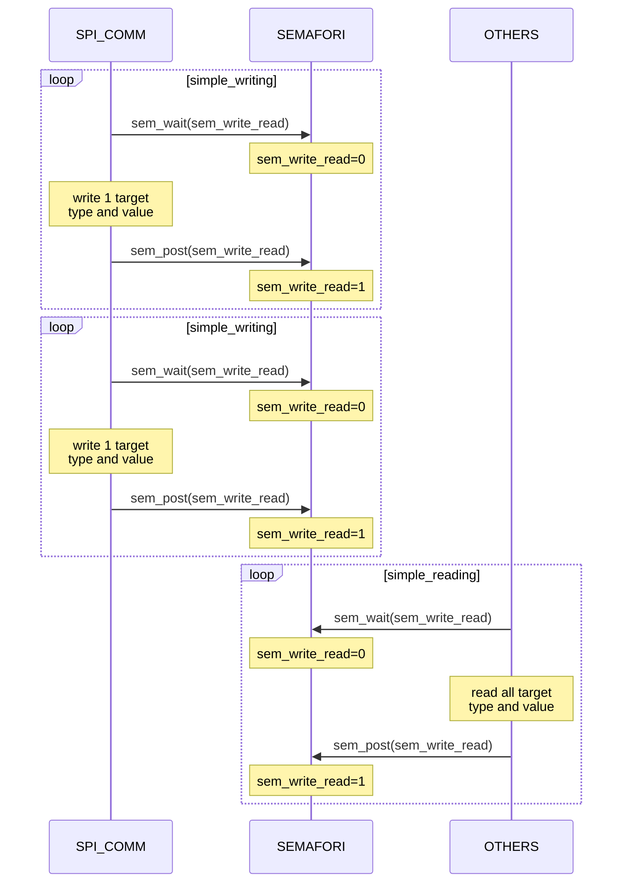
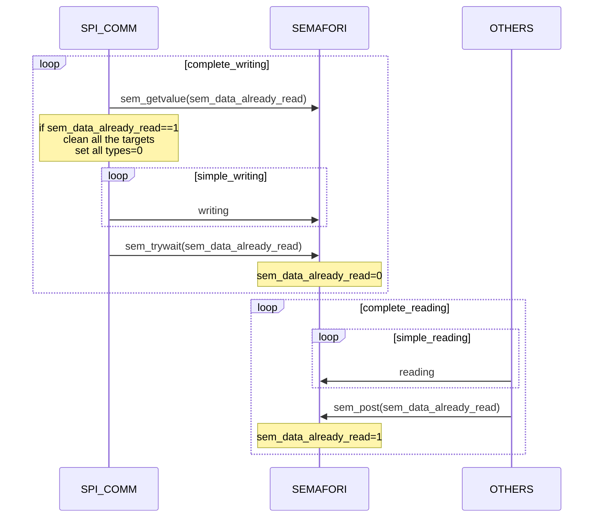
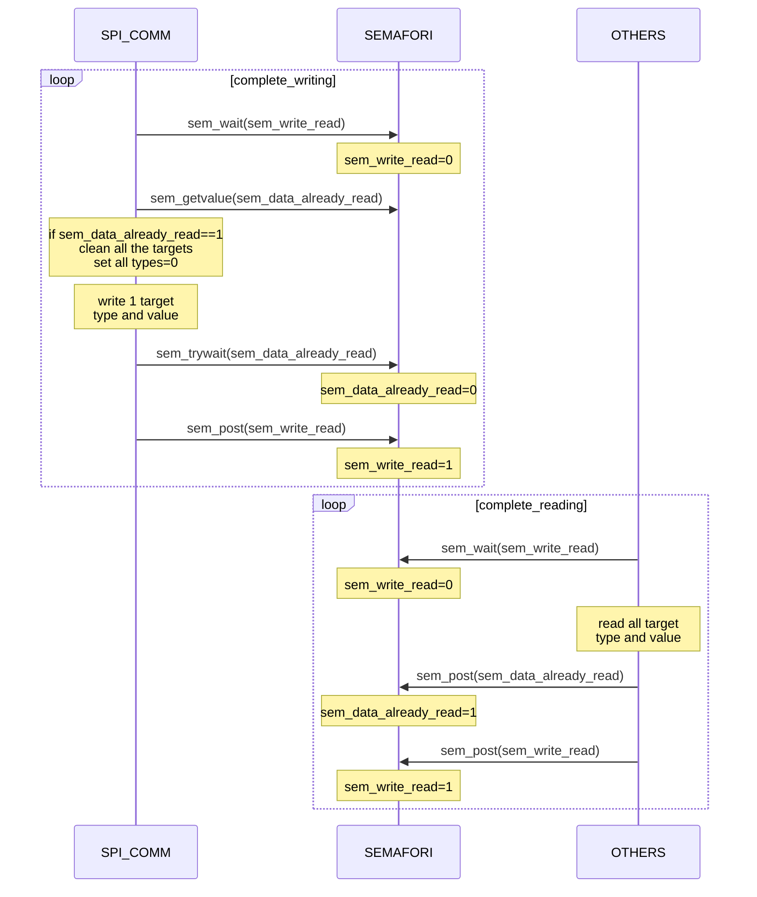

# Semafori

```mermaid
sequenceDiagram
  loop simple_writing
  SPI_COMM->>SEMAFORI: sem_wait(sem_write_read)
  Note over SEMAFORI: sem_write_read=0
  Note over SPI_COMM: write 1 target<br/>type and value
  SPI_COMM->>SEMAFORI: sem_post(sem_write_read)
  Note over SEMAFORI: sem_write_read=1
  end
  loop simple_writing
  SPI_COMM->>SEMAFORI: sem_wait(sem_write_read)
  Note over SEMAFORI: sem_write_read=0
  Note over SPI_COMM: write 1 target<br/>type and value
  SPI_COMM->>SEMAFORI: sem_post(sem_write_read)
  Note over SEMAFORI: sem_write_read=1
  end
  loop simple_reading
  OTHERS->>SEMAFORI: sem_wait(sem_write_read)
  Note over SEMAFORI: sem_write_read=0
  Note over OTHERS: read all target<br/>type and value
  OTHERS->>SEMAFORI: sem_post(sem_write_read)
  Note over SEMAFORI: sem_write_read=1
  end
```

```mermaid
sequenceDiagram
  loop complete_writing
  SPI_COMM->>SEMAFORI: sem_getvalue(sem_data_already_read)
  Note over SPI_COMM: if sem_data_already_read==1<br/>clean all the targets<br/>set all types=0
  loop simple_writing
  SPI_COMM->>SEMAFORI: writing
  end
  SPI_COMM->>SEMAFORI: sem_trywait(sem_data_already_read)
  Note over SEMAFORI: sem_data_already_read=0
  end
  loop complete_reading
  loop simple_reading
  OTHERS->>SEMAFORI: reading
  end
  OTHERS->>SEMAFORI: sem_post(sem_data_already_read)
  Note over SEMAFORI: sem_data_already_read=1
  end
```

```mermaid
sequenceDiagram
  loop complete_writing
  SPI_COMM->>SEMAFORI: sem_wait(sem_write_read)
  Note over SEMAFORI: sem_write_read=0
SPI_COMM->>SEMAFORI: sem_getvalue(sem_data_already_read)
  Note over SPI_COMM: if sem_data_already_read==1<br/>clean all the targets<br/>set all types=0
  Note over SPI_COMM: write 1 target<br/>type and value
  SPI_COMM->>SEMAFORI: sem_trywait(sem_data_already_read)
  Note over SEMAFORI: sem_data_already_read=0
  SPI_COMM->>SEMAFORI: sem_post(sem_write_read)
  Note over SEMAFORI: sem_write_read=1
  end
  loop complete_reading
  OTHERS->>SEMAFORI: sem_wait(sem_write_read)
  Note over SEMAFORI: sem_write_read=0
  Note over OTHERS: read all target<br/>type and value
  OTHERS->>SEMAFORI: sem_post(sem_data_already_read)
  Note over SEMAFORI: sem_data_already_read=1
  OTHERS->>SEMAFORI: sem_post(sem_write_read)
  Note over SEMAFORI: sem_write_read=1
  end
```
